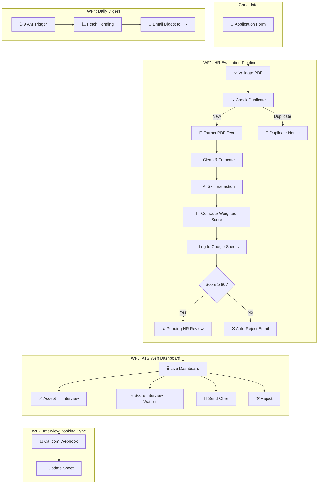
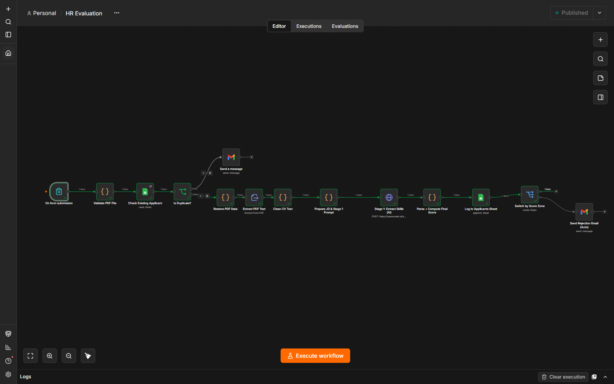
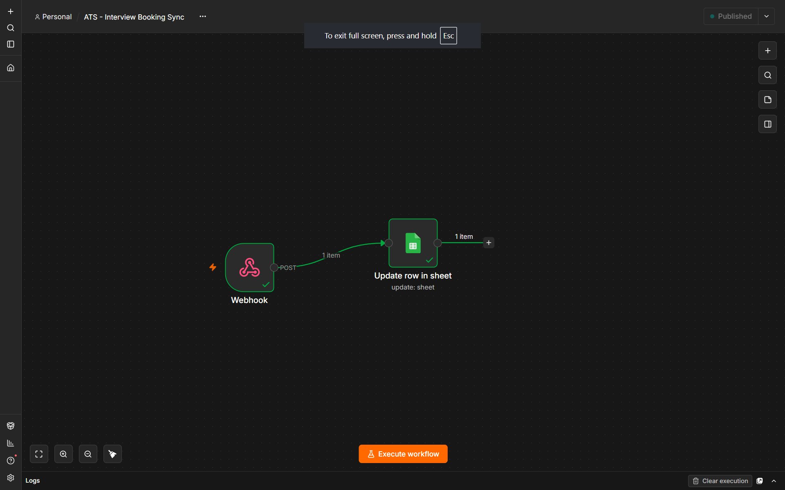
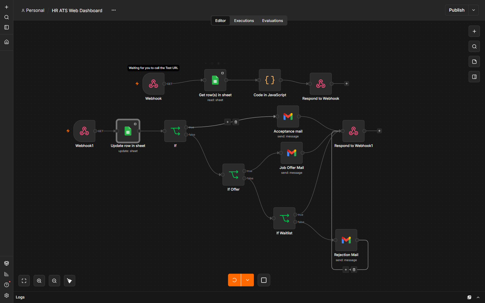
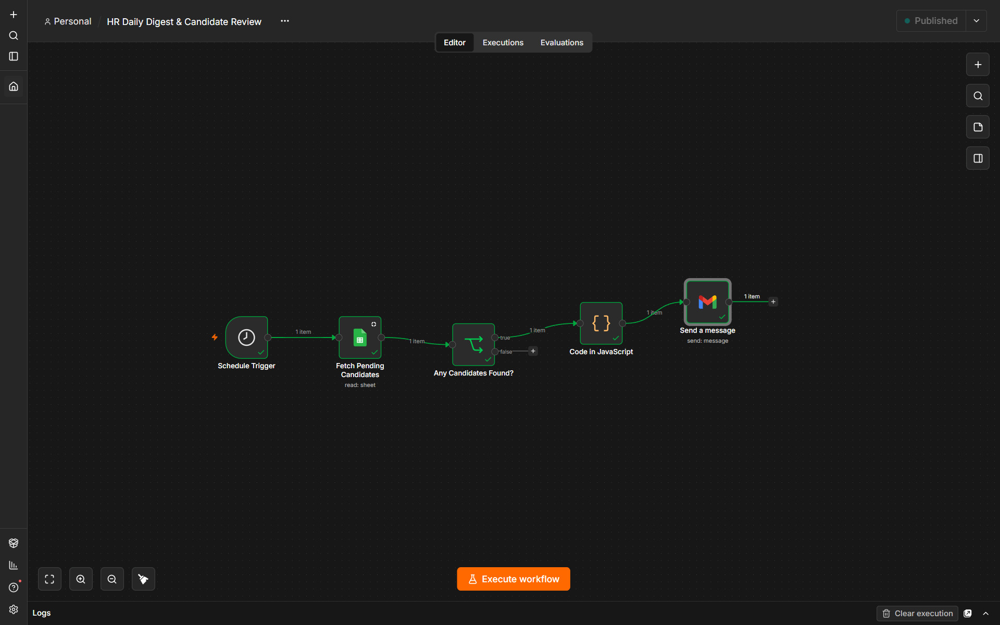

<p align="center">
  
</p>

<h1 align="center">🚀 n8n HR Automation — AI-Powered ATS</h1>

<p align="center">
  <strong>A fully automated Applicant Tracking System built with n8n, powered by AI evaluation, Google Sheets, Gmail, and Cal.com.</strong>
</p>

<p align="center">
  
  
  
  
  
  
</p>

---

## 📋 Table of Contents

- [Overview](#-overview)
- [System Architecture](#-system-architecture)
- [Workflows](#-workflows)
- [Features](#-features)
- [Scoring Algorithm](#-scoring-algorithm)
- [Prerequisites](#-prerequisites)
- [Quick Start](#-quick-start)
- [Configuration](#%EF%B8%8F-configuration)
- [Google Sheets Schema](#-google-sheets-schema)
- [Screenshots](#-screenshots)
- [Project Structure](#-project-structure)
- [Contributing](#-contributing)
- [License](#-license)

---

## 🌟 Overview

This project automates the **entire recruitment lifecycle** — from the moment a candidate submits their CV to the final job offer — using 4 interconnected n8n workflows. An AI model evaluates resumes against structured job descriptions, assigns weighted scores, and routes candidates through a multi-stage pipeline.

### What it does

1. **Candidate applies** via a web form (uploads PDF resume)
2. **AI evaluates** the CV against job-specific skill requirements
3. **Automatic routing** — high scorers go to HR review, low scorers get auto-rejected
4. **HR reviews candidates** on a real-time web dashboard with one-click actions
5. **Interviews are scheduled** via Cal.com, with auto-synced Google Meet links
6. **Daily email digest** keeps the hiring manager informed

---

## 🏗️ System Architecture



---

## 🔄 Workflows

### Workflow 1 — HR Evaluation Pipeline
> **File:** [`workflows/HR Evaluations.json`](workflows/HR%20Evaluations.json)

The core pipeline that processes job applications end-to-end:
- Accepts form submissions with PDF resume upload
- Validates file type (PDF) and size (≤ 5MB)
- Checks for duplicate applicants by email/phone
- Extracts and cleans resume text
- Sends to AI (via OpenRouter) for skill extraction against the job description
- Computes a weighted final score locally (no AI for math)
- Logs all results to Google Sheets
- Routes candidates: ≥80 → Pending Review, <80 → Auto-Reject with email

### Workflow 2 — Interview Booking Sync
> **File:** [`workflows/ATS - Interview Booking Sync.json`](workflows/ATS%20-%20Interview%20Booking%20Sync.json)

A lightweight webhook listener for Cal.com:
- Receives booking confirmations from Cal.com
- Extracts interview date, time, and Google Meet link
- Updates the corresponding candidate row in Google Sheets

### Workflow 3 — ATS Web Dashboard
> **File:** [`workflows/HR ATS Web Dashboard.json`](workflows/HR%20ATS%20Web%20Dashboard.json)

A full web-based recruitment dashboard served by n8n:
- **KPI Cards** — Total applications, pending reviews, scheduled interviews, waiting list, offers sent, rejections
- **Waiting List Pool** — Ranked by interview score, with Send Offer / Reject buttons
- **Post-Interview Evaluations** — Enter interview scores, add to waitlist or reject
- **Pending CV Reviews** — Accept for interview or reject with one click
- All actions trigger Gmail notifications and update the sheet in real-time

### Workflow 4 — Daily Digest & Candidate Review
> **File:** [`workflows/HR Daily Digest & Candidate Review.json`](workflows/HR%20Daily%20Digest%20%26%20Candidate%20Review.json)

An automated morning briefing for the hiring manager:
- Triggers daily at 9:00 AM
- Fetches all "Pending Review" candidates
- Generates a styled HTML email with candidate breakdown by role
- Includes a direct link to the ATS Web Dashboard

---

## ⭐ Features

| Feature | Description |
|---------|-------------|
| 🤖 **AI Resume Evaluation** | Uses OpenRouter models to extract skills, match against JD, and generate fit summaries |
| 📊 **Weighted Scoring** | 60% skills + 30% experience + 10% education + nice-to-have bonus |
| 🔄 **Duplicate Detection** | Prevents re-processing via email/phone lookup |
| 📝 **PDF Validation** | MIME type + extension + 5MB size limit checks |
| 🖥️ **Live Web Dashboard** | Server-rendered HTML dashboard with real-time data from Sheets |
| 📅 **Cal.com Integration** | Automated interview scheduling with Google Meet links |
| 📧 **Email Automation** | Acceptance, rejection, offer, and duplicate notification emails |
| ⏰ **Daily Digest** | Morning email to HR with pending candidate summary |
| 🗃️ **3 Job Roles** | Pre-configured: Frontend Engineer, Data Analyst, Product Manager |

---

## 📐 Scoring Algorithm

The system computes a **deterministic score out of 100** (no AI randomness for math):

```
Final Score = (Skills% × 0.60) + (Experience% × 0.30) + (Education% × 0.10) + Nice-to-Have Bonus

Where:
  Skills%      = Weighted match of required skills found in CV
  Experience%  = min(actual_years / required_years, 1.0)
  Education%   = 1.0 if match, 0.3 if no match
  Bonus        = up to 10% for nice-to-have skills matched
```

### Decision Zones

| Score | Zone | Action |
|-------|------|--------|
| **80–100** | 🟢 Auto-Approve | Sent to HR for manual review |
| **60–79** | 🟡 Manual Review | Requires HR decision |
| **0–59** | 🔴 Auto-Reject | Rejection email sent automatically |

---

## 📦 Prerequisites

- **[n8n](https://n8n.io/)** — Self-hosted or n8n Cloud
- **Google Account** — For Google Sheets + Gmail OAuth
- **[OpenRouter](https://openrouter.ai/) API Key** — For AI evaluation (free tier available)
- **[Cal.com](https://cal.com/) Account** — For interview scheduling (optional)

---

## 🚀 Quick Start

### 1. Clone the repository
```bash
git clone https://github.com/EslamTagElsir/n8n-HR-Automation.git
cd n8n-HR-Automation
```

### 2. Set up Google Sheets
Create a Google Sheet with the column headers listed in the [Schema section](#-google-sheets-schema) below.

### 3. Import workflows into n8n
1. Open your n8n instance
2. Go to **Workflows** → **Import from File**
3. Import all 4 JSON files from the `workflows/` directory

### 4. Configure credentials
- **Google Sheets OAuth2** — Connect your Google account
- **Gmail OAuth2** — Connect your Gmail account
- **OpenRouter API Key** — Add your key to the HTTP Request node headers

### 5. Update configuration
- Replace the Google Sheets URL in all workflows with your own sheet
- Update the Cal.com booking link in the acceptance email
- Set the daily digest recipient email

### 6. Activate all workflows
Toggle each workflow to **Active** in n8n.

---

## ⚙️ Configuration

| Setting | Where to Change | Default |
|---------|----------------|---------|
| OpenRouter API Key | WF1 → "Stage 1: Extract Skills (AI)" → Headers | `API KEY` (placeholder) |
| Google Sheet URL | All workflows → Google Sheets nodes | Your sheet URL |
| Daily Digest recipient | WF4 → "Send a message" → sendTo | Your HR email |
| Cal.com booking link | WF3 → "Acceptance mail" → message body | Your Cal.com link |
| Dashboard action URL | WF3 → "Code in JavaScript" → `actionWebhook` | `http://localhost:5678/webhook/ats-action` |
| AI Model | WF1 → "Stage 1" → jsonBody → model | `nvidia/nemotron-3-super-120b-a12b:free` |
| Timezone | WF2 → "Update row in sheet" → DateTime zone | `Africa/Cairo` |

> **💡 Tip:** For production, replace `localhost` URLs with your n8n instance domain.

---

## 📋 Google Sheets Schema

Your sheet should have these column headers (in order):

| Column | Field | Type | Description |
|--------|-------|------|-------------|
| A | `applicantName` | String | Full name from form |
| B | `applicantEmail` | String | Email address |
| C | `applicantPhone` | String | Phone number |
| D | `appliedPosition` | String | Position applied for |
| E | `extractedSkills` | String | AI-extracted skills list |
| F | `experienceYearsActual` | Number | Years of experience detected |
| G | `educationDetected` | String | Degree/institution found |
| H | `finalScore` | Number | Computed score (0–100) |
| I | `fitSummary` | String | AI-generated profile summary |
| J | `status` | String | Pipeline status |
| K | `applicationDate` | DateTime | Submission timestamp |
| L | `interviewScore` | Number | Post-interview score |
| M | `interviewNotes` | String | Interview notes |
| N | `interviewDate` | String | Scheduled interview datetime |
| O | `meetingLink` | String | Google Meet URL |

### Valid Status Values
`Pending Review` · `Interview Scheduled` · `Waiting List` · `Offer Sent` · `Auto-Rejected` · `Post-Interview Rejected`

---

## 📸 Screenshots

<details>
<summary><strong>🖼️ Click to expand workflow screenshots</strong></summary>

### WF1: HR Evaluation Pipeline


### WF2: Interview Booking Sync


### WF3: ATS Web Dashboard


### WF4: Daily Digest


</details>

---

## 📁 Project Structure

```
n8n-HR-Automation/
├── README.md                          # This file
├── LICENSE                            # MIT License
├── .gitignore                         # Git ignore rules
├── CONTRIBUTING.md                    # Contribution guidelines
│
├── workflows/                         # n8n workflow JSON exports
│   ├── HR Evaluations.json            # WF1: Core evaluation pipeline
│   ├── ATS - Interview Booking Sync.json  # WF2: Cal.com booking sync
│   ├── HR ATS Web Dashboard.json      # WF3: Web dashboard + actions
│   └── HR Daily Digest & Candidate Review.json  # WF4: Daily email digest
│
├── docs/                              # Documentation
│   ├── HR_ATS_Documentation.pdf       # System documentation
│   └── screenshots/                   # Workflow screenshots
│       ├── wf1-hr-evaluation.png
│       ├── wf2-interview-booking-sync.png
│       ├── wf3-ats-web-dashboard.png
│       └── wf4-daily-digest.png
│
└── assets/                            # Repository assets
    └── banner.svg                     # README banner
```

---

## 🤝 Contributing

Contributions are welcome! Please see [CONTRIBUTING.md](CONTRIBUTING.md) for guidelines.

1. Fork the repository
2. Create a feature branch (`git checkout -b feature/amazing-feature`)
3. Commit your changes (`git commit -m 'Add amazing feature'`)
4. Push to the branch (`git push origin feature/amazing-feature`)
5. Open a Pull Request

---

## 📄 License

This project is licensed under the MIT License — see the [LICENSE](LICENSE) file for details.

---

## 👤 Author

**Eslam Tag ElSir**
- GitHub: [@EslamTagElsir](https://github.com/EslamTagElsir)

---

<p align="center">
  <sub>Built with ❤️ using n8n workflow automation</sub>
</p>
